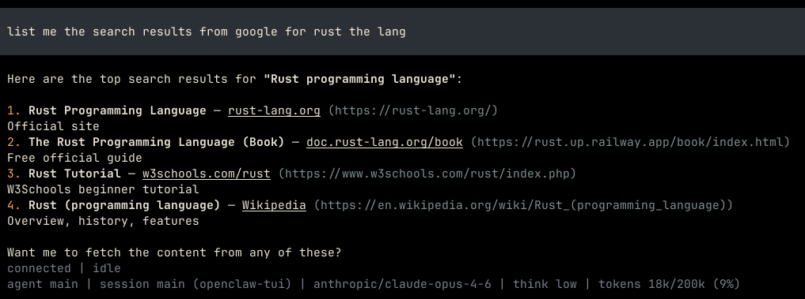

# icrawl-google-search

Add free Google search capability to your openclaw without needing any API keys or payments. The way it works is it pretends to be GSA and scrapes Google search results. From tests, it works with VPNs too.

### Installation

Build the project in release mode, and copy the binary from target/release to ~/.local/bin/. Then add your skill and restart the openclaw daemon.

### Picture

